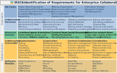

# IRECS - Identification of Requirements for Enterprise Collaboration SystemsUse Cases

## Use Cases

### Basic Use Cases

| # | Name (English) | Name (Deutsch) | Description | Beschreibung |
| - | - | - | - | - |
| 1 | Project Team Organisation | Projektteamorganisation | Organization of a project (all phases starting with forming a team based on knowledge/skills, planning milestones and managing tasks, preparing and documenting meetings) | Organisation eines Projekts (in allen Phasen beginnend mit der Teamzusammenstellung aufgrund von Kenntnissen/Fähigkeiten, Planen von Meilensteinen und Aufgabenverwaltung, Vorbereitung und Dokumentation von Sitzungen) |
| 2 | Organisational Unit Organisation | Organisationseinheitenorganisation | Cooperation in organizational workgroups or departments (joint information storage, task management, resource management, meetings, documentation, instructions, manuals) | Zusammenarbeit in organisationalen Einheiten bzw. Abteilungen (gemeinsame Informationsablage, Aufgabenverwaltung, Ressourcenverwaltung, Sitzungen, Dokumentation, Anleitungen, Handbücher) |
| 3 | Internal Corporate Communication | Interne Unternehmenskommunikation | Provision of information to employees about important company issues (e.g. strategy, business areas, culture) | Informationsversorgung der Mitarbeitenden über wichtige Belange des Unternehmens (z.B. Strategie, Geschäftsfelder, Kultur). |
| 4 | Knowledge Management | Wissensmanagement | Documentation of the specialist knowledge and experience of employees in order to make this knowledge available in the company (e. g. through joint creation and writing of shared documents and search options) | Dokumentation von Fachwissen und Erfahrungen der Mitarbeitenden, um dieses Wissen im Unternehmen verfügbar zu machen (durch gemeinsames Zusammenstellen und Schreiben von Dokumenten und Suchmöglichkeiten). |
| 5 | Networking | Networking | Presentation of employees' skills and competencies (in the social profile) and networking with other people. Following people and content of interest | Präsentation der eigenen Fähigkeiten und Kompetenzen (im Social Profile) und Vernetzung mit anderen Personen. Folgen von Personen und Inhalten, die von Interesse sind. |
| 6 | Meeting Organisation | Sitzungsorganisation | Planning, preparation and implementation of meetings (e.g. invitations with agenda and lists of participants, short surveys, documentation of the results) | Planung, Vorbereitung und Durchführung von Sitzungen (z.B. Einladungen mit Agenda und Teilnehmerlisten, Kurzumfragen, Dokumentation der Ergebnisse) |
| 7 | Asynchronous Discussion | Asynchrone Diskussion | Time-delayed exchange of ideas and opinions on specific topics (typically in discussion forums with posts and replies) | Zeitversetzter Austausch von Ideen und Meinungen zu bestimmten Themen (typischerweise in Diskussionsforen mit Beiträgen und Antworten) |
| 8 | Synchronous Discussion | Synchrone Diskussion | (Near) synchronous conversation and exchange of information on specific topics (typically in simultaneous video/audio conversations or chat channels) | (Annähernd) synchrone Unterhaltung und Austausch von Informationen zu bestimmten Themen (typischerweise zeitgleich in Video-/Audiounterhaltungen oder in Chat-Kanälen) |
| 9 | Ad hoc Teamwork | Ad hoc Gruppenarbeit | Spontaneous collaboration in groups (e.g. for coordination, urgent questions, feedback or ideation) | Spontane Zusammenarbeit in Gruppen (z.B. für Koordination, dringende Fragen, Feedback oder Ideenfindung) |
| 10 | Idea and Innovation Management | Ideen- und Innovationsmanagement | Support for submission of ideas for improvements (employee suggestion system) | Unterstützung der Eingabe von Ideen für Verbesserungen (Betriebliches Vorschlagswesen) |
| 11 | Information Storage | Informationsablage | Provision and use of information and files in a shared repository that supports exchange and search | Bereitstellung und Nutzung von Informationen und Dateien in einer gemeinsamen Ablage, die den Austausch und die Suche unterstützt |
| 12 | Document Creation | Dokumentenerstellung | Joint creation and enrichment of documents | Gemeinsame Erstellung und Anreicherung von Dokumenten |
| 13 | Task Management | Aufgabenverwaltung | Planning and assignment of tasks (ToDos) to people | Planen und Zuordnung von Aufgaben (ToDos) zu Personen. |

### Composite/Complex/Special Use Cases

| # | Name (English) | Name (Deutsch) | Description | Beschreibung |
| - | - | - | - | - |
| 14 | Internal Employee Communication | Interne Mitarbeiterkommunikation | General exchange of information between the employees of a company (synchronously in voice and video or asynchronously in text messages and multimedia contributions). Bottom-up, top-down and between equals. (#7+#8) | Unterstützung des allgemeinen Informationsaustauschs zwischen den Mitarbeitern eines Unternehmens (synchron in Bild und Ton oder asynchron in Textnachrichten und multimedialen Beiträgen). Bottom-up, top-down und zwischen Gleichgestellten. |
| 15 | Enterprise Social Network (ESN) | Soziales Unternehmensnetzwerk (ESN) | Networking by means of social features and social profiles (subscribing to or following job-relevant people/topics; mutually pointing out relevant information with @mention or like). Aim is to exchange information, increase awareness and to identify topic experts. (#5+#14) | Vernetzung von Mitarbeitenden mit Hilfe sozialer Funktionen und Sozialen Profilen (Abonnieren/Folgen von jobrelevanten Personen/Themen, gegenseitiges Hinweisen auf relevante Informationen (@mention/like)) |
| 16 | Social Intranet | Soziales Intranet | Overview and access to relevant information and files for employees (Intranet) provided by the communication department, with additional “social features” that enable employees to add to the content. | Zentrale Informationsversorgungs- und Austauschplattform für Mitarbeitende mit sozialen Funktionen (Vernetzen mit Personen, Abonnieren/Folgen von jobrelevanten Personen/Themen, gegenseitiges aktives Hinweisen auf relevante Informationen (@mention/like)) |

### Industry-specific Use Cases

| # | Name (English) | Name (Deutsch) | Description | Beschreibung |
| - | - | - | - | - |
| 17 | Software Development | Softwareentwicklung | Support for teams in collaborative software development (e. g. meeting support, task man-agement, resource management, documentation, versioning) | Unterstützung für Teams in der kollaborativen Softwareentwicklung (z.B. Sitzungsunterstützung, Aufgabenverwaltung, Ressourcenverwaltung, Dokumentation) |
| 18 | Event Management | Eventmanagement | Organisation of events (planning, preparation, implementation, e.g. of trade fairs, customer events, works assembly) | Organisation von Veranstaltungen (Planung, Vorbereitung, Durchführung z.B. von Messen, Kundenevents, Betriebsversammlungen) |
| 19 | Teaching Course Organisation | Kursorganisation | Organisation of a course (schedule, collection of materials, group formation, communication with and among the participants) | Organisation einer Lehrveranstaltung (Zeitplan, Materialsammlung, Gruppenbildung, Kommunikation mit und unter den Teilnehmenden) |

## Collaboration Scenarios

| # | Name (English) | Name (Deutsch) | Description | Beschreibung | Software Module |
| - | - | - | - | - | - |
| 1 | Administering documents | Dokumente verwalten | Structured storage, classification and archiving of documents | Strukturierte Ablage, Klassifikation und Archivierung von Dokumenten | Files |
| 2 | Administering social profile | Expertenprofil pflegen | Creation and maintenance of social profiles (e.g. for the identification of experts in the network) | Anlegen und Pflegen von Social Profiles für die Identifikation von Themenexperten im Enterprise Social Network | Social profiles |
| 3 | Administering tasks | Aufgaben verwalten | Creation and maintenance of tasks (e.g. assigning tasks to persons or marking them as completed) | Aufgaben (Todos) erfassen, Personen zuordnen und als erledigt markieren | Tasks |
| 4 | Alerting | Auf Neuigkeiten hinweisen | Purposefully pointing out and drawing attention to something (e.g. notifying others of new information that might be of interest to them) | Hinweise auf neue Informationen, die für andere von Interesse sein könnten | alle |
| 5 | Conducting a meeting | Sitzung durchführen | Meeting with other people synchronously (e.g. in person or virtually) | Sich persönlich oder virtuell mit anderen Personen treffen | Video Conference |
| 6 | Conducting a poll/vote | Abstimmung durchführen | Identification of a favourite from given options or obtaining an opinion rating (e.g. quick polls) | Einen Favoriten aus vorgegebenen Optionen ermitteln oder ein Meinungsbild einholen | Ideation blog |
| 7 | Conducting a survey | Umfrage durchführen | Collection of structured information (e.g. using a questionnaire) | Erhebung strukturierter Informationen mittels eines Fragebogens | Survey |
| 8 | Discussing a topic | Thema diskutieren | Synchronous or asynchronous conversation between people on a particular topic (e.g. posting a question and responding to it) | Synchrone oder asynchrone Unterhaltung zwischen Personen zu einem bestimmten Thema | Forum |
| 9 | Documenting | Dokumentieren | Composing the core content of all kinds of information for the purposes of documenting new content (e.g. creating text, images or videos) | Verfassen aller Art von Informationen (Verschriftlichung in Texten, Bild-, Ton- und Videoerzeugung) | Wiki |
| 10 | Enriching information or content maintenance | Informationen anreichern/pflegen | Enhancing and correcting existing content (e.g. by adding text, metadata, annotations or corrections) | Anreichern und Korrigieren von Informationen, z.B. durch Hinzufügen von Text, Metadaten, Annotationen, Korrekturen (Text "wertvoller" machen) | alle |
| 11 | Following people and content | Leuten und Content folgen | Following people’s profiles and content items for receiving notifications in case of changes or updates | Personenprofilen und Inhaltsobjekten folgen (für den Erhalt einer Nachricht bei Änderungen/Neuerungen) | Follow |
| 12 | Giving feedback | Feedback geben | Directed provision of any kind of feedback to people about the content (e.g. the author of a blog post or the owner of a file) | Any kind of feedback for the author | Like |
| 13 | Joint authoring | Gemeinsam Inhalte erstellen | Synchronous or asynchronous, collaborative content creation of two or more users within a timeframe with the outcome of a document, file etc. | Synchrone oder asynchrone, gemeinsame Erstellung von Dokumenten, Artikeln etc. | Docs |
| 14 | Posting a short message | Kurznachricht posten | Writing and publishing a short message (e.g. a news item on a microblog) | Verfassen und publizieren einer kurzen Mitteilung/Neuigkeit | Microblog |
| 15 | Preparing a meeting/event | Sitzung/Event vorbereiten | Organisational steps to prepare for a meeting or event (e.g. finding a date, booking resources like rooms, setting up an agenda, inviting participants) | Organisatorische Schritte zur Vorbereitung eines Meetings wie Finden eines Termins, Buchen von Räumen/Ressourcen, Aufsetzen einer Agenda, Einladen der Teilnehmer, etc. | |
| 16 | Rating information | Informationen bewerten | Assessment of the perceived quality of content or the usefulness of certain information on a scale | Beurteilung der empfundenen Inhaltsqualität oder Eignung bestimmter Informationen auf einer Skala | |
| 17 | Retrieving information | Informationen abrufen | All types of directed information retrieval (e.g. downloading files, scanning for updates) | Alle Arten der Informationsgewinnung, Scannen nach Updates, Herunterladen von Dateien | alle |
| 18 | Search | Suchen | Search for information (e.g. with the help of search functions) | Suche nach Informationen (ggf. mit Hilfe von Suchmaschinen) | |
| 19 | Sharing files | Dateien teilen | To make files available to others (e.g. uploading a document) | Zur Verfügungsstellen von Dateien für andere Personen | Files |
| 20 | Sharing information | Informationen teilen | Making information (existing or created for this purpose) available | Bereitstellung von (existierenden oder zu diesem Zweck erstellten) Informationen | |
| 21 | Writing meeting minutes | Protokoll schreiben | Writing minutes to record important information from meetings or committees (e.g. as a wiki page) | Schreiben von Protokollen | Wiki, Tasks |